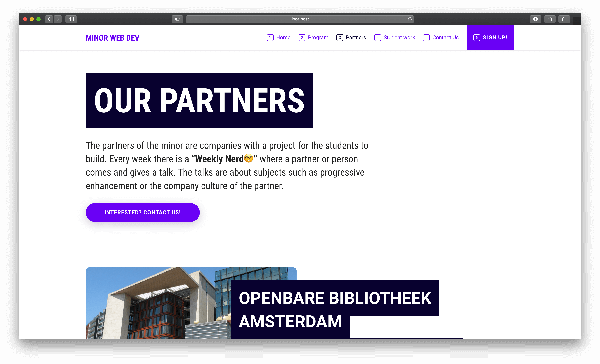
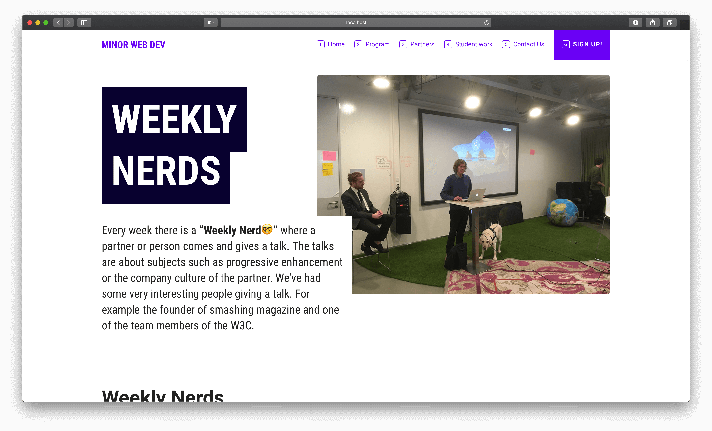

# Contribution of James Peter Perrone Jefferies

In this file, you can find more personal information like my learning goals and the stuff I worked on. General information about this project can be found inside our **[README.md](./README.md)**. The website can be seen **[here](https://redesign-minor.kager.io)**.

You can also find my entire progress with I updated every day **[here](https://jamerrone.github.io/meesterproef-progress-blog/)**.

**Table of Contents**

- [Contribution of James Peter Perrone Jefferies](#contribution-of-james-peter-perrone-jefferies)
  - [Personal Learning Goals](#personal-learning-goals)
  - [Templates & Components I Worked On](#templates--components-i-worked-on)
  - [Functionality I Worked On](#functionality-i-worked-on)
  - [University Subjects](#university-subjects)

## Personal Learning Goals

**Learn how to build and manage complex project structures. For example, components splitting, folder structure, and name conventions.**

Before we actually started coding I created the necessary files and folder structure based on tips & tricks I found online. Name conventions like BEN are way too complicated and hard to read. Because of this, I decided to work on a component-based level. Each component get's a single class, elements inside of it are selected by its parent's class. For example `.mainNavigation ul` & `.mainNavigation a`. This meant we could split our entire codebase into smaller components. Each element got it’s own HTML, JavaScript and CSS file. Changes were easily made when necessary and the code stayed very readable.

Right now we have one folder for each file type. A folder with every JavaScript file, a folder with every HTML file and a folder with every CSS file. I really wish I had created different folders for each component. For example a mainNavigation folder with its own CSS, JavaScript and HTML file. This should make finding things a lot easier.

For GIT I used a simpler version of GIT-Flow, where each component got its own branch. Once completed the feature branch was merged inside the development branch.

**Don’t be afraid to try new stuff out, be creative, and build awesome stuff where users can say: WoW!**

This learning goal was for me personally the most important one. Every component I built I tried to give it personality and a different twist to it. A good example is the homepage header were users can edit it’s CSS and functionality like the spatial navigation. More information about this learning goal can be found in my progress blog and below.

**Don’t write “quick fixes” or “prototype code”. Try to write good code from the start. Because I know that I won’t refactor it later.**

This one was hard. Like really really hard. But I found out that this was not a good learning goal at all. I tried to do my best to write the best code I could, I even posted some examples online asking for feedback. The biggest thing I learned about this one is that it is impossible to write the perfect code I actually wanted. You can write the same functionality millions of different ways.

In the end, I stopped trying to write perfect code and focused on my general coding style and code conventions.

## Templates & Components I Worked On

**Partners & Team Page**



Can be seen **[here](https://redesign-minor.kager.io/partners)**.

**Contact Page**


Can be seen **[here](https://redesign-minor.kager.io/contact)**.

**Sign-Up Page**


Can be seen **[here](https://redesign-minor.kager.io/signup)**.

**Headers**



Can be seen **[here](https://redesign-minor.kager.io/program/weekly-nerd)**.

PS: While the templates and components above were all written by me, they may have been edited by other’s. Just like I have edited other people's work.

## Functionality I Worked On

**Spatial Navigation**

In the end I used a premade script for the spatial navigation, however, I did build my own version beforehand not knowing there already existed a script for this functionality.

The script I used can be found **[here](https://github.com/luke-chang/js-spatial-navigation)**.

**Auto Focus on Scroll**

Marijn once told me that he hated the fact that the focus state always started at the top of the webpage. He normally scrolls through content with the arrow keys or the spacebar, in case he finds something interesting he needs to spam tap until he get’s where he wants. I wrote a simple script that runs on the scroll event. It automatically focuses the first link of the central section.

Simply put, the focus state updates dynamically based on what is displayed on the screen. The user will never need to spam the tap key again.

You can find the script responsible for this functionality **[here](./app/src/js/focus-on-scroll.js)**.

**Homepage Header**


The homepage header is mostly for entertainment and for the WoW factor. The concept behind it is quite simple, onLoad the header is displayed with almost no CSS. There is a small editor where the code is automatically typed and the header is dynamically updated based on the editor. While this is only an animation, any user can actually update or change any CSS rule. They can even add new rules!

The small code editor uses **[highlight.js](https://highlightjs.org)** for its syntax highlighting. The script that types the code and updates the header is very simple. It actually loops through a string containing the entire CSS. Each character is then copied inside a style tag. I am super proud of this one!

```javascript
function typewriterAnimation() {
  setTimeout(() => {
    styleElement.innerHTML += additionalHeaderStyling[currentCharacter];
    headerCodeEditor.querySelector('code').innerHTML +=
      additionalHeaderStyling[currentCharacter];
    currentCharacter++;
    headerCodeEditor.scrollTop = headerCodeEditor.scrollHeight;
    if (currentCharacter < additionalHeaderStyling.length) {
      if (additionalHeaderStyling[currentCharacter] === '}') {
        hljs.highlightBlock(headerCodeEditor);
      }
      typewriterAnimation();
    }
  }, 10);
}
```

You can find the entire script **[here](./app/src/js/the-wow-header.js)**.

PS: Like the templates and components I have worked on much more functionality than this three, but the ones mentioned above were all written by me.

## University Subjects

I wish I could say that I worked on all six subjects during this final project. And while this is almost true I never touched Performance Matters or Real-Time Web. Performance Matters was part of Jelle’s learning goals so we depended on him in order to keep our website fast and fluid. Real-Time Web was not part of our concept and using **[socket.io](http://socket.io)** just to say we used it was not a good option.

Subjects like CSS To The Rescue and Web APP From Scratch were obviously used. There is no way we could have to build any website without using the different techniques we learned from this two subjects. The only difference was that WAFS used OOP techniques while I choose to use the Functional Programming approach. This was just about personal preferences.

My biggest focus between subjects was Web Design. I always hear from people around me that my designs are simple and clean. While this always worked just fine, they all lacked personality. I have built every component keeping the WoW factor in mind. All I ever wanted was to impress a user with animations or fun interactions. The homepage header is the component where this can be seen the best, it is also my proudest contribution to our website.

My progress blog can be found **[here](https://jamerrone.github.io/meesterproef-progress-blog/)**.
